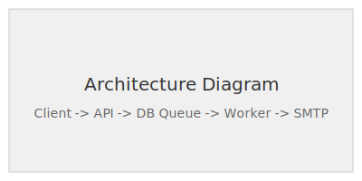
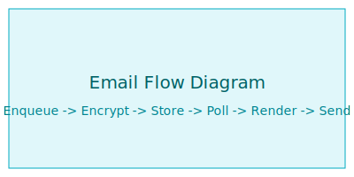

# Maatify Channel Delivery

[](https://packagist.org/packages/maatify/channel-delivery)

[](https://packagist.org/packages/maatify/channel-delivery)

[](LICENSE)

[](https://github.com/Maatify/channel-delivery/actions)


## Overview

**Maatify Channel Delivery** is a standalone async multi-channel delivery microservice for sending notifications across channels like **Email, Telegram, SMS, and Push**.

It offloads delivery processing from your core applications, ensuring:

- High availability
- Background delivery processing
- Retry mechanisms
- Secure payload encryption
- Controlled API ingestion

Currently, the **Email channel is fully implemented and production-ready**.
Additional channels such as **SMS, Telegram, and Push notifications** are planned for future releases.

---

## Features

- **Async Multi-Channel Queue**
  Process notifications asynchronously using background workers.

- **Encrypted Payloads**
  Built-in `AES-256-GCM` encryption for recipients and message contexts via `maatify/crypto`.

- **Template Rendering**
  Uses **Twig** to render dynamic email templates safely.

- **Robust Delivery**
  Exponential retry strategy for transient delivery failures.

- **API Key & IP Whitelisting**
  Secure ingestion endpoints allowing only trusted origin servers.

- **Rate Limiting**
  Redis-backed sliding window rate limiter to prevent abuse.

- **Containerized Dependency Injection**
  Built on **Slim 4 + PHP-DI** for modular and testable architecture.

---

## Architecture

The system operates as an **API ingestion layer combined with background workers**.

Applications enqueue notification jobs via HTTP. Workers then process the queue and deliver messages asynchronously.



The email delivery pipeline is powered internally by the
[`maatify/email-delivery`](https://github.com/Maatify/email-delivery)
library, which provides the rendering, transport abstraction,
and delivery engine.

---

## Email Delivery Pipeline

```
Client Application
↓
Channel Delivery API
↓
Encrypted Queue (Database)
↓
Worker
↓
SMTP Transport
↓
Recipient

```

Detailed processing steps:

1. **Enqueue**
   Client calls `/api/v1/email/enqueue`.

2. **Encryption**
   `EnqueueEmailHandler` encrypts recipient and context via `Maatify\Crypto`.

3. **Persistence**
   Job stored securely in `cd_email_queue`.

4. **Worker Polling**
   `EmailQueueWorker` polls pending jobs.

5. **Template Rendering**
   Context is decrypted and injected into Twig templates.

6. **SMTP Delivery**
   Email is sent via `SmtpEmailTransport`.



---

## Requirements

- PHP **8.2+**
- MySQL / MariaDB
- Redis
- SMTP server
- Composer

---

## Related Projects
- [`maatify/email-delivery`](https://github.com/Maatify/email-delivery) – email delivery engine
- [`maatify/crypto`](https://github.com/Maatify/crypto) – encryption layer

---

## Installation

Clone the repository or install via Composer:

```bash
composer create-project maatify/channel-delivery
cd channel-delivery
```

Install dependencies:

```bash
composer install --optimize-autoloader --no-dev
```

---

## Configuration

Create the environment configuration file:

```bash
cp .env.example .env
```

Edit `.env` and configure the following variables.

### Application

| Variable        | Description                                            |
| --------------- | ------------------------------------------------------ |
| `APP_ENV`       | Application environment (`development` / `production`) |
| `APP_NAME`      | Name of the service instance                           |
| `SUPPORT_EMAIL` | Support contact email                                  |

---

### Database

| Variable      | Description       |
| ------------- | ----------------- |
| `DB_HOST`     | Database host     |
| `DB_PORT`     | Database port     |
| `DB_DATABASE` | Database name     |
| `DB_USERNAME` | Database username |
| `DB_PASSWORD` | Database password |

Example:

```env
DB_HOST=127.0.0.1
DB_PORT=3306
DB_DATABASE=channel_delivery
DB_USERNAME=root
DB_PASSWORD=secret
```

---

### Encryption (Crypto)

Queue payloads and sensitive data are encrypted using **AES-256-GCM** through `maatify/crypto`.

| Variable               | Description                             |
| ---------------------- | --------------------------------------- |
| `CRYPTO_ACTIVE_KEY_ID` | Identifier of the active encryption key |
| `CRYPTO_KEYS`          | JSON array containing encryption keys   |

Example:

```env
CRYPTO_ACTIVE_KEY_ID=v1
CRYPTO_KEYS='[{"id":"v1","key":"replace_with_32_byte_secret_here"}]'
```

Key requirements:

* Key must be **exactly 32 bytes**
* Keys support **rotation**
* Old keys remain for **decryption only**

Generate a secure 32-byte key:

```bash
php -r "echo bin2hex(random_bytes(16));"
```

This will generate a **32-character string**, for example:

```
a3f9c2d1e4b5f6a7c8d9e0f1a2b3c4d5
```

Then place it inside the `.env` configuration:

```env
CRYPTO_ACTIVE_KEY_ID=v1
CRYPTO_KEYS='[{"id":"v1","key":"a3f9c2d1e4b5f6a7c8d9e0f1a2b3c4d5"}]'
```

Key requirements:

* Must be **exactly 32 characters**
* Used as the symmetric encryption key for AES-256-GCM
* Keys support **rotation**

---

### SMTP

SMTP configuration used by the email delivery worker.

| Variable            | Description                     |
| ------------------- | ------------------------------- |
| `MAIL_HOST`         | SMTP server host                |
| `MAIL_PORT`         | SMTP server port                |
| `MAIL_USERNAME`     | SMTP username                   |
| `MAIL_PASSWORD`     | SMTP password                   |
| `MAIL_FROM_ADDRESS` | Default sender email            |
| `MAIL_FROM_NAME`    | Sender display name             |
| `MAIL_ENCRYPTION`   | Encryption type (`tls` / `ssl`) |
| `MAIL_TIMEOUT`      | SMTP timeout (seconds)          |
| `MAIL_DEBUG`        | SMTP debug mode (0 = disabled)  |

---

### Redis

Redis is used for **rate limiting**.

| Variable                    | Description                               |
| --------------------------- | ----------------------------------------- |
| `REDIS_HOST`                | Redis host                                |
| `REDIS_PORT`                | Redis port                                |
| `REDIS_PASSWORD`            | Redis password (optional)                 |
| `REDIS_DB`                  | Redis database index                      |
| `RATE_LIMIT_MAX_REQUESTS`   | Maximum requests allowed                  |
| `RATE_LIMIT_WINDOW_SECONDS` | Rate limit window duration                |
| `TRUSTED_PROXIES`           | Trusted proxy IPs (for `X-Forwarded-For`) |

Example:

```env
REDIS_HOST=127.0.0.1
REDIS_PORT=6379
RATE_LIMIT_MAX_REQUESTS=100
RATE_LIMIT_WINDOW_SECONDS=60
```

---

## Quick Example

Enqueue an email using the provided script:

```bash
export CD_BASE_URL=http://localhost:8080
export CD_API_KEY=your_generated_api_key
php scripts/test_enqueue.php
```

Or via cURL:

```bash
curl -X POST http://localhost:8080/api/v1/email/enqueue \
  -H "Content-Type: application/json" \
  -H "X-Api-Key: your_generated_api_key" \
  -d '{
    "entity_type": "user",
    "recipient": "user@example.com",
    "template_key": "welcome",
    "language": "en",
    "sender_type": 1
  }'
```

---

## Worker Usage

Run the email worker:

```bash
php scripts/email_worker.php --batch=50 --loop --sleep=5
```

This worker should normally run under a **process manager** like Supervisor or systemd.

See the worker setup guide:

[Run Worker Guide](docs/how-to/run-worker.md)

---

## Documentation

* [Run Worker Guide](docs/how-to/run-worker.md)
* [Send Email Guide](docs/how-to/send-email.md)
* [API Documentation: Email Enqueue](docs/api/email-enqueue.md)
* [Basic Usage Example](docs/examples/basic-usage.php)

---

## License

This project is open-sourced software licensed under the **MIT License**.

See the [LICENSE](LICENSE) file for details.
